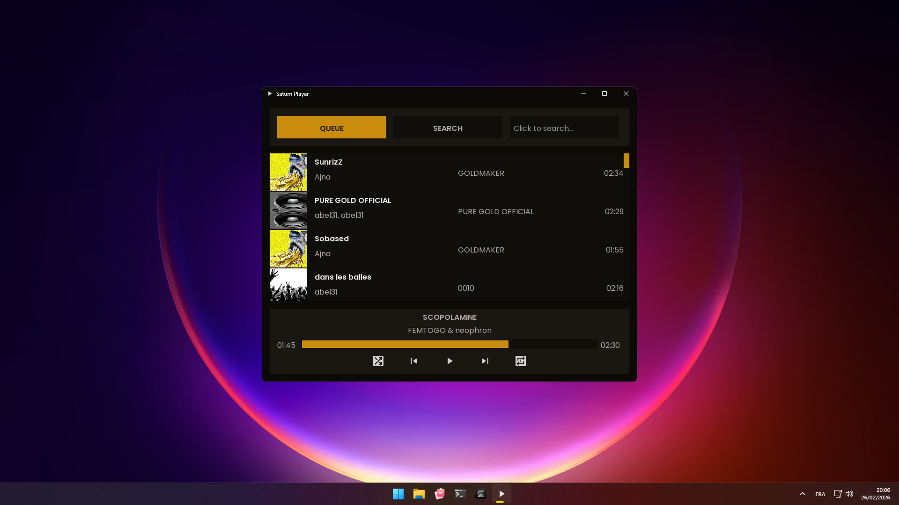
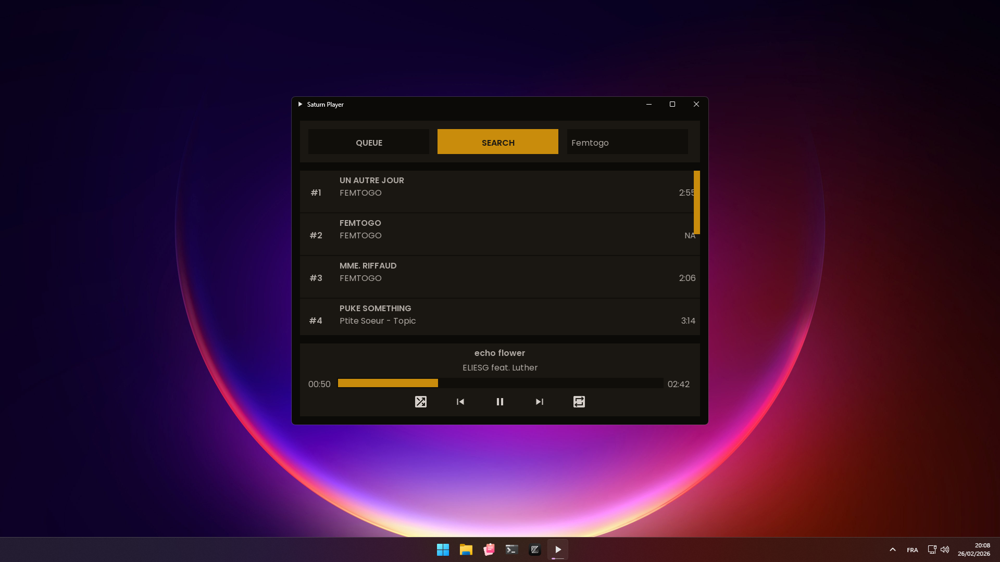

# Music Player in C 

WORK IN PROGRESS, FEEL FREE TO CONTRIBUTE

Minimal desktop music player written in C for Linux and Windows.

Supports downloading songs directly from **YouTube Music**, MP3/WAV/OGG/FLAC playback, metadata extraction, and embedded cover rendering.

---

## Features

* MP3/WAV/OGG/FLAC? playback
* Download songs from YouTube Music
* Metadata extraction (artist, album, cover)
* Embedded album art rendering
* Threaded song loading

---

## Dependencies

* [FFmpeg](https://github.com/FFmpeg/FFmpeg) (`libavformat`)
* [Freetype](https://download.savannah.gnu.org/releases/freetype/)
* [raylib](https://github.com/raysan5/raylib)
* [Clay](https://github.com/nicbarker/clay)
* [yt-dlp](https://github.com/yt-dlp/yt-dlp)
  
---

## Build

Requirements:

* C compiler (gcc / clang)
* `make`
* yt-dlp downloaded and set in path with deno and ffmpeg to path (needed for yt-dlp to fetch and download properly, see the yt-dlp wiki for more info)


ON WINDOWS: https://github.com/skeeto/w64devkit download the zip and extract it, cd in and launch w64devkit.exe
```bash
#for linux in cmd and windows in w64devkit.exe
git clone https://github.com/ZachVFXX/SaturnPlayer.git
cd SaturnPlayer/
make release_build # Wait, it build all the dependencies for you :)
# or `make release` if you already made the command release_build and dont need to rebuild all dependencies
./saturn_player ~/path_to_music_folder/
```

---

## Images

Windows:



---

Size (778 MP3s) Its only for me to monitor the optimization, its not updated

* Debug:          380MB RAM - 73MB binary
* Release:         92MB RAM - 73MB binary
* Release + strip: 70MB RAM - 17MB binary

---

## TODO

* Custom raylib `config.h` for smaller binaries CHECK.
* Arena linked list (remove `realloc`).
* Custom install script (build custom raylib + custom FFmpeg + custom Freetype) and use it for automatic build.
* Reorganize the structure of the project.
* Add settings (set audio format, colors etc..)
* FIX FLAC AUDIO SUPPORT 

---

## License

This project is licensed under the MIT License.
See the [LICENSE](./LICENSE) file for details.
